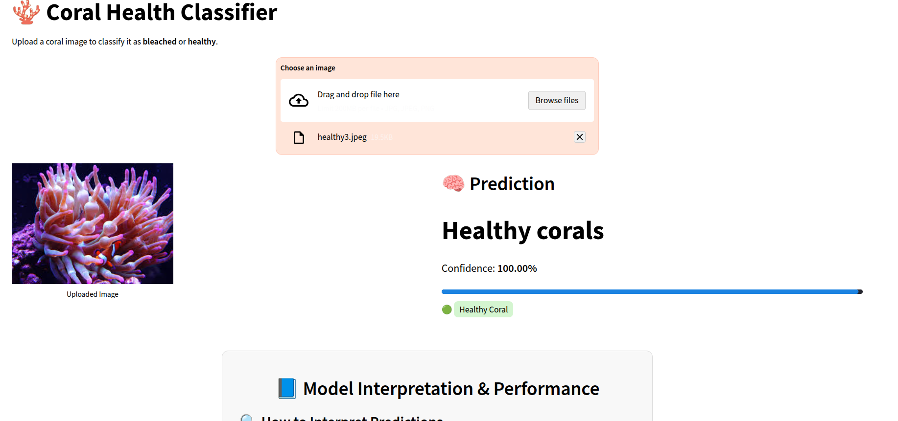

# 🪸 Coral Health Classifier 

A deep learning web app that classifies coral images as **bleached** or **healthy** using a Convolutional Neural Network (CNN), deployed with **Streamlit**.

---

## 🌊 About the Project

This interactive app uses:
- 🧠 **Convolutional Neural Networks (CNNs)**
- ⚙️ **TensorFlow** and **Keras** for training and prediction
- 🎛️ **Adam optimizer** for adaptive learning
- 🎨 **Streamlit** for the web UI
- 🐍 **Python** for all back-end logic and data handling

Upload a coral photo and receive a prediction with confidence, model interpretation, and architecture overview.

---

## 🌐 Background: Why Coral Bleaching Matters

Coral reefs are critical ecosystems that host thousands of marine species. But climate change, especially rising ocean temperatures, can disrupt their balance.

A temperature increase of just 2°F can cause corals to expel the algae (zooxanthellae) that give them nutrients and color, resulting in **coral bleaching**. Bleached corals are more vulnerable to disease, struggle to reproduce, and can die without recovery.

Coral reefs protect coastlines from storms, support biodiversity, and generate billions in tourism. Their loss impacts wildlife, food security, coastal safety, and economies.  

Coral bleaching is preventable. Local actions like reducing pollution and fertilizer runoff help. But the global driver is **climate change**, and even small increases in ocean temperature can trigger mass bleaching.

Bleached reefs are vulnerable and may never recover. Without intervention, reef ecosystems collapse, affecting species survival, livelihoods, and global biodiversity.

---

## 🗂️ Dataset

**Kaggle Dataset:** [Healthy and Bleached Corals](https://www.kaggle.com/datasets/vencerlanz09/healthy-and-bleached-corals-image-classification?select=healthy_corals)

| Feature              | Value                         |
|----------------------|-------------------------------|
| Total Images         | 923                            |
| Healthy Coral Images | 438                            |
| Bleached Coral Images| 485                            |
| Format               | JPEG                           |
| Max Size             | 300px (width or height)        |
| Source               | Flickr API                     |

The dataset was curated for training classification models to detect coral bleaching in real-world conditions.

---

## 🧠 About the Model

- 📦 **Architecture:** 3 convolutional layers (ReLU + MaxPooling) → Flatten → Dense layers with dropout → Output sigmoid
- 🔧 **Loss Function:** Binary Crossentropy  
- 🧪 **Optimizer:** Adam  
- 🔄 **Regularization:** Dropout to reduce overfitting  
- 📊 **Training:** 10 epochs with early stopping

### 📈 Validation Metrics
| Metric     | Value   |
|------------|---------|
| Accuracy   | 81.3%   |
| Precision  | 84.4%   |
| Recall     | 79.2%   |

### 📊 Confusion Matrix

|                       | Predicted: Bleached | Predicted: Healthy |
|-----------------------|---------------------|---------------------|
| **Actual: Bleached**  | 92                  | 12                  |
| **Actual: Healthy**   | 19                  | 69                  |

---

## 📱 App Preview



---

## 🚀 Try the App
💻 **Run Locally:**

```bash
git clone https://github.com/yourusername/CoralClassification.git
cd CoralClassification
pip install -r requirements.txt
streamlit run app/main.py
